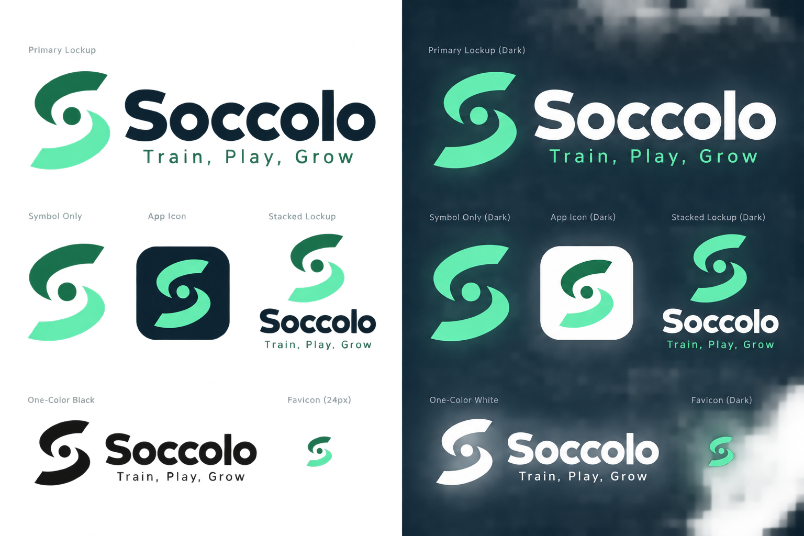
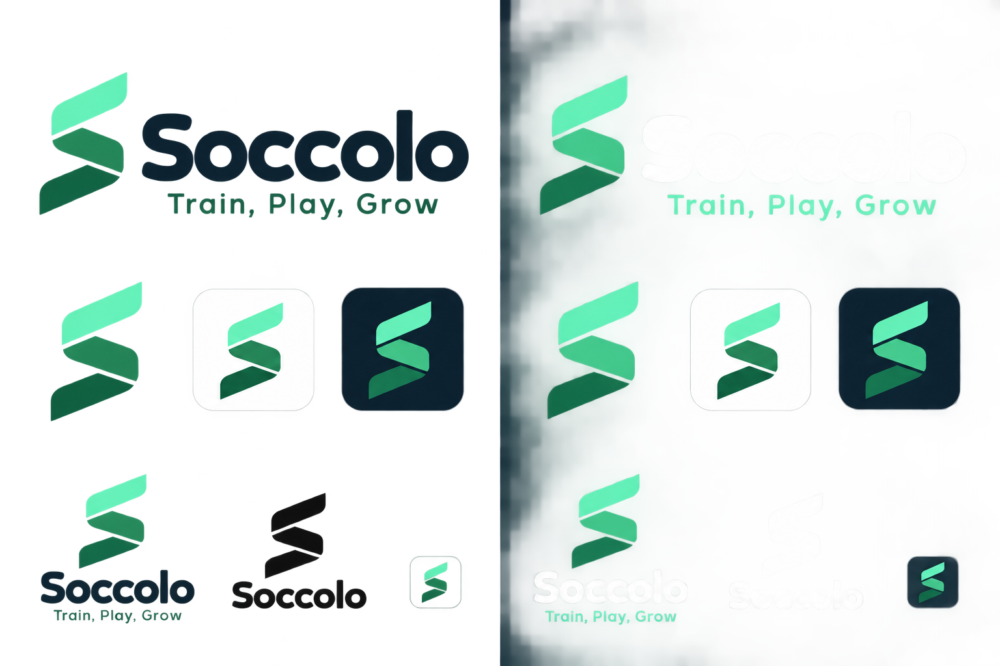
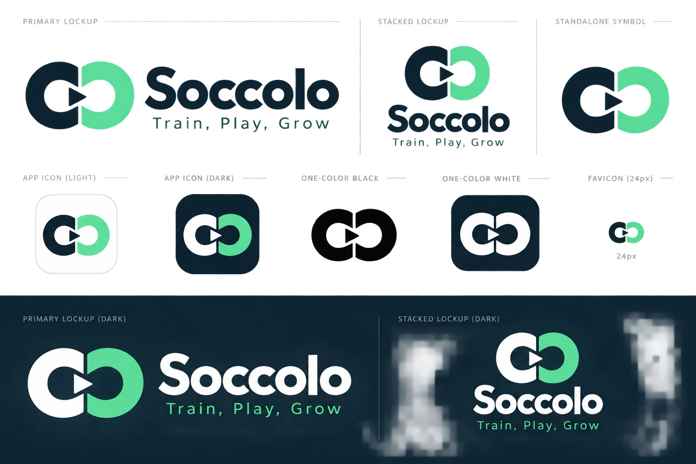
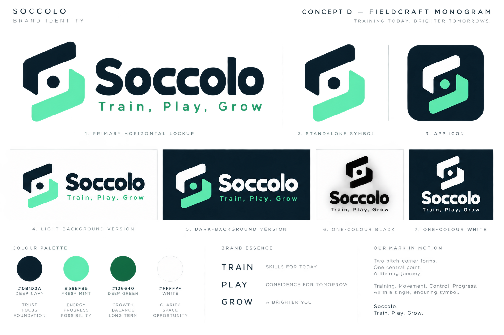
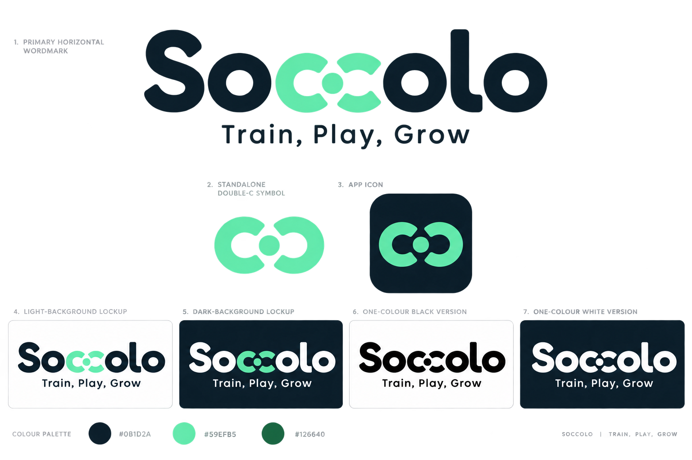
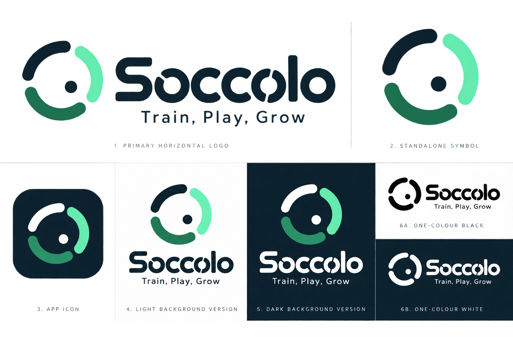

# ACT-SP-076-01 — Brand assets and ownership review packet

| Field | Recorded value |
|---|---|
| Artifact version | 0.9 superseded candidate-history record |
| Prepared | 14 September 2026 |
| Activity | `ACT-SP-076-01` — Prepare review packet: Prepare brand assets and ownership record |
| Source issue | `SP-076` |
| Phase / gate | P01 / G1 |
| Executor | Codex acting as Delivery / analysis agent |
| Accountable owner / reviewer | Syed Ahmed acting as Founder/product designer; role consolidation is disclosed |
| Repository/base | `https://github.com/sumarahmed/SoccerAPP.git`; `main`; `5994d3cc47dd9fffe1a7eb261d5be7c5f84ad7fc` |
| Run identity | `PREP-ACT-SP-076-01-20260914-08`; attempt 1 of 2 |
| Approved path | `docs/design/ACT-SP-076-01-brand-assets-and-ownership-review.md` |
| Authority | Syed Ahmed's instructions on 14 September 2026 to adopt `Soccolo` with the theme `Train, Play, Grow` as the provisional working lock while keeping both values changeable throughout the product |
| Spend/external effects | AUD 0; local review packet only; no name registration, trade-mark application, domain purchase, commission, supplier contact, upload or publication |
| Status | Decision-preparation review completed; the later supplied Soccolo Brand Bundle v2 was accepted and SP-076 closed on 14 September 2026 |

This packet establishes the exact current asset/rights position, records the founder-selected provisional identity, and presents a zero-spend route for the remaining decision in `ACT-SP-076-02`. It does not treat preliminary searches, a repository name, a working label or a generated concept image as legal clearance or an original logo master.

> **Superseding record — 14 September 2026:** Syed Ahmed subsequently selected and approved the externally supplied [`Soccolo-Brand-Bundle v2`](<brand/Soccolo-Brand-Bundle v2/README.md>) instead of the internal Concept E v0.1–v0.3 candidate. The inventory and concept comparison below are retained as history at the time this preparation packet was produced. The controlling accepted review is [ACT-SP-076-02 version 1.0](ACT-SP-076-02-soccolo-brand-bundle-review.md), and the controlling decision is [SP-076 version 1.0](../decisions/SP-076-brand-assets-and-ownership.md).

## 1. Fixed predecessors and inputs

| Input | Accepted/current position | Use |
|---|---|---|
| [SP-001 launch assumptions](../decisions/SP-001-launch-and-account-assumptions.md) | Australia and English are the first market/language | Initial name/rights search is Australia-first but should avoid a name that needlessly blocks later international expansion |
| [SP-004 pilot metrics, budget and specialist scopes](../decisions/SP-004-pilot-metrics-budget-and-specialist-scopes.md) | AUD 0 incremental discovery spend; Syed Ahmed alone may authorize external contact/commitment | Free internal preparation/search only; no registration, paid legal work, design commission or domain purchase is authorized |
| [Pilot and design pack](soccer_pilot_and_design_pack.md) | “Soccer Practice” was explicitly a descriptive working label with no availability claim | Superseded for new product-facing work by the provisional `Soccolo` identity; retain only in historical records until deliberately migrated |
| Repository/tracker labels | `SoccerAPP` repository and `SoccerTrainingApp` tracker/project labels | Technical/operational identifiers only; not evidence of brand selection or rights |

## 2. Current asset and rights inventory

| Item | Current evidence | Status |
|---|---|---|
| Working product name | `Soccolo`, selected by Syed Ahmed on 14 September 2026 | Provisional working lock and changeable; not legally cleared or finally locked |
| Working theme/tagline | `Train, Play, Grow`, selected by Syed Ahmed on 14 September 2026 | Canonical provisional wording; changeable and not claimed as an exclusive mark |
| Superseded placeholder | `Soccer Practice` appears in the design pack and is marked descriptive/non-final | Do not introduce in new product-facing work; preserve in historical evidence until a controlled migration |
| Candidate history | `GOALARI` was declined because `.com` was unavailable; `PlayRoo` was screened and rejected because of active gaming/children's uses and registered `.com`/`.com.au` domains | Preserve as decision evidence; neither is an active product-facing candidate |
| Repository name | `SoccerAPP` | Technical identifier; not a cleared public mark |
| Tracker/team label | `SoccerTrainingApp` | Operational identifier; not a cleared public mark |
| Concept screens/boards | Three historical PNG concept boards under `packages/soccer_agent_activity_package_20260908/design/` plus six Soccolo review boards under `docs/design/brand/` | Visual planning evidence only; no logo ownership/launch approval |
| Logo master | No SVG, AI, EPS, editable vector master or documented source file found | Missing |
| Light/dark variants | No approved logo variants found | Missing |
| Export-intro asset | Two-second logo-first treatment is proposed, but no approved asset exists | Missing |
| Rights register | No creator assignment, licence, third-party component register or provenance record found | Missing |
| Name/trade-mark checks | Preliminary exact-string and limited variant checks recorded in section 3 | Performed as a knockout screen only; not legal clearance |
| Registration/commission | No registration, application, supplier contact, quote, payment or commission exists | Not performed; prohibited under current AUD 0 authority |

## 3. Preliminary `Soccolo` research — 14 September 2026

### 3.1 Findings

| Surface | Query/scope | Result | Interpretation |
|---|---|---|---|
| IP Australia Australian Trade Mark Search | Exact `SOCCOLO`, plus `SOCOLO` and `SOKOLO` variants | Zero results in each inspected query | Encouraging Australian knockout result only. IP Australia warns that exact searches are insufficient and an examiner may find similar marks. |
| USPTO federal trade-mark search | Exact combined-mark query `CM:SOCCOLO` | No results found | Encouraging US knockout result only; broader pronunciation, visual similarity and related goods/services remain unsearched. |
| EUIPO-coordinated TMview | Contains search for `SOCCOLO` | Four Indian registrations containing `SOCCOLOR`, in construction/material classes 6 and 19; no exact `SOCCOLO` result surfaced | The returned marks appear commercially remote from the expected software/coaching scope, but a professional similarity review remains required. TMview states that its information has no legal effect and official registers control. |
| WIPO Global Brand Database | Intended exact/similar search | Interface could not be reliably completed in this run | Open. WIPO advises searching national/regional registers as well because its database does not cover every mark. |
| General web search | Exact name and football/app combinations | No competing software or football brand using the exact name surfaced; results were primarily surnames and Italian-language/common-word references | Exact commercial collision was not evident in this limited search, but common-law and local-market use is not exhaustively checked. |
| Apple App Store and Google Play web-index checks | Exact `Soccolo` | No exact app listing surfaced in indexed search results | Preliminary only; store search/index coverage is incomplete and should be repeated immediately before launch. |
| Nearby football names | Phonetic/general market scan | `Sokolo Foundation` operates youth football programs and the Sokolo Football Academy in Uganda | Not an exact match, but it is relevant to an international phonetic-similarity and youth-football review. |
| Linguistic/cultural scan | Exact term and close forms | `soccolo` has historical Italian use for a base/pedestal or wooden footwear and also occurs as a surname | No obvious harmful meaning surfaced, but the name is not globally meaningless. Native-speaker review is still appropriate for launch markets. |
| Domains via registry RDAP/DNS | `soccolo.com`, `.app`, `.io`, `.com.au`, `.ai` | All five returned no RDAP registration record and no A record in the checks used | Strong preliminary domain position and satisfies the founder's `.com` screening requirement. A 404/no-DNS response is not a purchase or registrability guarantee; same-day registrar confirmation is required. No domain was purchased or reserved. |
| ASIC business-name availability | Exact candidate | Not conclusively checked in the authenticated ASIC availability workflow | Open. Business-name availability would not confer trade-mark rights in any event. |
| Social handles | Major networks | Not conclusively checked because public results and login-gated availability are unreliable | Open; perform a same-day handle check only when reservation is authorized. |

Official search/guidance entry points used or consulted: [IP Australia TM Checker](https://www.ipaustralia.gov.au/tm-checker), [Australian Trade Mark Search](https://search.ipaustralia.gov.au/trademarks), [IP Australia search guidance](https://www.ipaustralia.gov.au/trade-marks/search-existing-trade-marks), [USPTO search guidance](https://www.uspto.gov/trademarks/search/federal-trademark-searching), [WIPO Global Brand Database](https://www.wipo.int/en/web/global-brand-database), [WIPO availability guidance](https://www.wipo.int/en/web/madrid-system/check-availability), [EUIPO IP search](https://www.euipo.europa.eu/en/search-ip), [ASIC name availability](https://asic.gov.au/for-business/registering-a-business-name/before-you-register-a-business-name/business-name-availability/) and [Australian Government business-name guidance](https://business.gov.au/planning/new-businesses/choose-a-business-name).

### 3.2 Research conclusion

`Soccolo` is a credible provisional working name and is more distinctive than `Soccer Practice`. It passed the founder's key preliminary requirements: the exact name did not surface in the inspected Australian or US trade-mark searches, no exact app or competing football/software brand surfaced, and the five checked domains—including `.com`—returned no registration record. The recommended risk rating is **green–amber / proceed with a provisional working lock**, not a claim that the name is cleared, registrable or exclusive. International/common-law coverage remains incomplete, the similar-sounding `Sokolo` youth-football use needs assessment, and relevant classes have not received a professional similarity opinion.

`Train, Play, Grow` communicates the intended product loop clearly and is suitable as the canonical provisional theme. Its common sports/development verbs are inherently promotional/descriptive. Treat the line as brand messaging, not the primary protectable identifier, pending advice.

Preliminary goods/services coverage for a later professional search should consider at least downloadable software/mobile apps (Nice class 9), sports coaching/education (class 41), and SaaS/software services (class 42), with any communication, marketplace or business-administration services added only if the final product scope requires them. Classification and filing scope remain specialist decisions.

## 4. Required changeable-brand architecture

The product must treat `Soccolo` and `Train, Play, Grow` as content/configuration, not permanent technical identifiers. Before user-facing development introduces either value, establish one versioned brand manifest as the canonical source for at least:

```text
brandId: working-soccolo-v1
status: provisional
displayName: Soccolo
tagline: Train, Play, Grow
legalEntityName: null
logoAssetSet: pending
```

All visible surfaces—including web/mobile UI, metadata, emails, notifications, exports, support text and store-copy sources—must consume that manifest or a generated equivalent. Add an automated repository check/test that rejects new hard-coded occurrences outside the manifest, migration fixtures and historical evidence.

Stable technical identifiers should **not** be renamed merely to match the provisional brand: repository names, package/application IDs, database names, API namespaces, infrastructure resource names and Linear identifiers should remain independent unless a separate migration is approved. Historical receipts, audit events and exported records should retain the brand/version actually shown at the time. A later name change should therefore be a reviewed manifest/asset update, not a breaking system migration.

A case-insensitive repository scan on 14 September 2026 found `Soccer Practice` on 11 text lines across 3 files, `SoccerAPP` on 76 lines across 29 files, and `SoccerTrainingApp` on 362 lines across 27 files. Most `SoccerAPP`/`SoccerTrainingApp` instances are repository, tracker or historical delivery identifiers and should not be mass-replaced. The controlled implementation must classify each occurrence as product-facing copy, stable technical identity or historical evidence before changing it.

## 5. Recommended decision route

### Stage 1 — use the founder-selected provisional identity now

Use **Soccolo** with **Train, Play, Grow** as the product-design identity under a provisional working lock until the final name completes the rights route. Every approval artifact using it must identify the name as provisional/changeable. Do not use `™` or `®`, claim exclusivity, publish a launch asset or infer rights from repository/domain/business-name availability.

This route allows dependent theme/export specifications to proceed with a replaceable identity while keeping `AC-SP-076-02` truthful. It does not complete `AC-SP-076-01` or `AC-SP-076-03`.

### Stage 2 — select and clear a distinctive candidate

Before committing to a public final name:

1. Confirm intended goods/services and the first filing/launch markets for `Soccolo`.
2. Complete class-specific exact, phonetic, visual and conceptual similarity searches, ASIC availability, WIPO/national registers, domains, app stores and common-law market use.
3. Obtain native-speaker/cultural review for intended expansion markets.
4. Obtain appropriate trade-mark/legal advice before relying on availability or filing in Australia or another market.
5. Record the search scope/date/results, unresolved conflicts, territories/classes, decision-maker and any approved registration route.

ASIC name availability is not trade-mark clearance. Australian Government guidance states that business-name or domain registration does not itself provide exclusive brand rights and recommends separate trade-mark checking: [Choose a business name](https://business.gov.au/planning/new-businesses/choose-a-business-name) and [ASIC name availability](https://asic.gov.au/for-business/registering-a-business-name/before-you-register-a-business-name/business-name-availability/).

### Stage 3 — create original controlled masters

After the final name/direction is approved, create or separately commission an original logo under an explicit rights assignment/licence. The delivery must include:

- editable vector master (`.svg` plus the creator's native editable source where applicable);
- light, dark, monochrome and transparent variants;
- square app-icon source with safe-area guidance;
- fixed-background export-intro variant and motion/timing specification;
- colour/type tokens, minimum size, clear space and prohibited-use guidance;
- font and third-party asset licences or a statement that none are used;
- creator identity, creation/commission date, source/provenance and signed rights terms; and
- checksums/version plus named founder approval of the exact launch files.

No paid creator, filing, domain or registration action may begin under the current AUD 0 cap. A later spend decision must name the amount, scope, recipient, rights deliverables and approval authority before commitment.

## 6. Options for owner review

| Option | Effect | Assessment |
|---|---|---|
| A — use `Soccolo` / `Train, Play, Grow` under an explicitly provisional working lock | Dependent design work can proceed through the versioned manifest; final rights/master work stays open | Selected by founder; recommended under AUD 0 |
| B — lock `Soccolo` as the irreversible/final public identity now | Faster, but exceeds the evidence: similarity, business-name, international/common-law and professional review remain incomplete | Not recommended yet |
| C — treat `SoccerAPP` or `SoccerTrainingApp` as the final mark | Fast, but neither has rights evidence and both are highly descriptive | Not recommended without the full route |
| D — commission/register immediately | Could progress final assets but creates external commitment/spend | Not authorized under SP-004 |

## 7. Owner decisions recorded and requested

| ID | Decision | Recommended disposition |
|---|---|---|
| `OD-076-01` | Current working name | **FOUNDER SELECTED:** `Soccolo`, provisionally locked for current work but changeable until final launch lock |
| `OD-076-02` | Working theme | **FOUNDER SELECTED:** `Train, Play, Grow`, canonical provisional wording and changeable until final launch lock |
| `OD-076-03` | Changeability requirement | **FOUNDER DIRECTED:** centralize brand values; do not couple the provisional public name to stable technical identifiers |
| `OD-076-04` | Rights route | **REVIEW PENDING:** accept the staged class-specific ASIC/IP Australia/WIPO/national/domain/app-store/common-law and professional-review route; no clearance is claimed today |
| `OD-076-05` | Asset route | **REVIEW PENDING:** accept the original-master deliverables in section 5; do not commission or register under AUD 0 |
| `OD-076-06` | Approval authority | **REVIEW PENDING:** Syed Ahmed is the named founder approver for the exact final name and launch asset; specialist/legal clearance remains separate where required |
| `OD-076-07` | Visual direction | **FOUNDER SELECTED 14 SEPTEMBER 2026:** Concept E — Double Touch Wordmark; selection authorizes refinement only and does not approve the generated PNG as a final master |

## 8. Source acceptance position

| Criterion | Current outcome | What completes it |
|---|---|---|
| `AC-SP-076-01` — Rights and source files recorded | NOT MET | Cleared selected name, rights/provenance register and delivered editable source masters |
| `AC-SP-076-02` — Placeholder clearly marked if final brand is pending | MET FOR THIS PACKET | `Soccolo` and its theme are explicitly recorded as a provisional working lock and changeable; future product implementation must use the manifest pattern |
| `AC-SP-076-03` — Final launch asset has named approval | NOT MET | Exact final asset version/checksum and Syed Ahmed's dated approval after rights evidence |

`ACT-SP-076-01` was complete as a decision-preparation activity following the founder's concept selection and instruction to move to the next activity. The later dated [ACT-SP-076-02 decision](../decisions/SP-076-brand-assets-and-ownership.md) records the accepted human outcome. Syed Ahmed approved bundle v2, accepted its disclosed rights/trade-mark risk and authorized closure and publication on 14 September 2026; `SP-076` and `ACT-SP-076-02` are therefore complete under that controlling decision.

## 9. Review checklist

- [x] Current names, concept assets, source-master absence and rights-evidence absence are inventoried.
- [x] Proposed decisions remain labelled proposals.
- [x] AUD 0 and external-contact/commitment authority are preserved.
- [x] Business-name, domain and trade-mark rights are distinguished.
- [x] Placeholder progression is separated from final launch approval.
- [x] Each source criterion has evidence or an exact missing input.
- [x] Syed Ahmed selected `Soccolo` and `Train, Play, Grow` under a provisional working lock and required product-wide changeability.
- [x] A dated preliminary exact-name knockout screen is recorded with limitations.
- [x] Six generated visual directions are provided with wordmark, symbol, app-icon, Light/Dark and monochrome concept treatments.
- [x] Syed Ahmed selected Concept E — Double Touch Wordmark as the refinement direction; the concept PNG is not a final master.
- [ ] Syed Ahmed reviews `OD-076-04` through `OD-076-06`.
- [ ] Class-specific similarity, ASIC, WIPO/national, common-law, handle and launch-date app-store checks are completed before final lock.
- [ ] Rights/source files and exact final launch approval remain open.

Review focus: select or revise a visual direction and confirm the green–amber/provisional recommendation, changeable-brand architecture, remaining rights route and original-master deliverables. Do not accept SP-076 as fully complete unless a final cleared name, controlled source masters and named approval actually exist.

## 10. Soccolo visual identity concept review

These generated PNG boards are project-specific exploration aids for selecting a direction. They are not editable vector masters, registered marks, accessibility evidence or approved launch assets. Generation from a project-specific prompt does not prove that a result is unique or non-infringing. Their glow/lighting presentation is illustrative and must not be copied into the final flat master unless separately approved and tested.

### Concept A — Precision Play



- **Idea:** an `S`-shaped training path with a touch/contact point.
- **Strengths:** energetic, compact and recognizably sports-oriented without a literal football.
- **Risks:** the swirl silhouette is relatively common; the light-side render has inadequate contrast and must be rebuilt rather than reused.

### Concept B — Play Forward



- **Idea:** three ascending connected touches represent `Train, Play, Grow`.
- **Strengths:** clearest progression story and a simple app-icon silhouette.
- **Risks:** the ribbon form is generic and could resemble unrelated technology brands; the concept-board glow and gradients are not acceptable final-master treatments.

### Concept C — Connected Touches



- **Idea:** two interlocking `C` forms reference Soccolo's double `cc`; the negative-space arrow suggests passing, repetition and forward progress.
- **Strengths:** strongest name-specific rationale, most distinctive of the three, effective app-icon structure, and naturally supports one-colour and reversed variants.
- **Risks:** the central arrow may be read as a media Play button; the final design should test an arrow, passing lane and no-arrow refinement at 16–24 pixels.
- **Earlier recommendation:** Concept C was the strongest of the initial three, subject to a clean flat redraw and small-size/confusion testing. Concept D now supersedes it as the recommended lead direction.

### Concept D — Fieldcraft Monogram



- **Idea:** two custom pitch-corner/training-gate shapes create an abstract `S` around a single first-touch point.
- **Strengths:** strongest professional silhouette; sports meaning without a generic football; credible for junior pathways, teenagers, adults, coaches and clubs; works naturally as a compact app icon.
- **Risks:** the board's glow is presentation-only, and the geometry must be redrawn so it cannot be confused with a generic route, camera or hexagonal technology mark.
- **Recommendation:** use Concept D as the primary refinement direction, with Concept E's softer wordmark character considered as a controlled hybrid.

### Concept E — Double Touch Wordmark



- **Idea:** the adjacent `cc` letters become two training gates around a shared passing/contact point.
- **Strengths:** most name-specific and approachable option; makes the wordmark memorable; feels suitable for young participants without excluding adult users.
- **Risks:** the isolated `cc` can resemble a chain link, infinity mark or existing collaboration/technology symbol. It requires a substantially differentiated redraw and similarity search before selection.
- **Founder decision:** **SELECTED 14 September 2026** as the controlled refinement direction. Preserve the friendly wordmark-led idea while redesigning the `cc` geometry to address the recorded confusion/collision risk.
- **Revision history:** after v0.1, Syed Ahmed supplied a crop of the selected design and v0.2 restored its inward-facing unit. Following that review, Syed Ahmed explicitly required the adjacent `o`/`c` forms to overlap, both middle `c` forms to open rightward and the centre touch point to be larger.
- **Current refinement:** the [Concept E v0.3 review bundle](brand/soccolo-e-v0.3/README.md) implements the latest direction consistently across editable masters, wordmark, app, light/dark, monochrome and export assets.
- **Current similarity position:** v0.3 removes the close inward-facing Cuepri arrangement identified in v0.2. The standalone double-C device remains amber/uncleared because that field is crowded and Creative Commons asserts `CC` marks; official image-upload searches and professional assessment remain required.

### Concept F — Momentum Ring



- **Idea:** three progressive training-route segments express `Train, Play, Grow` around an off-centre touch point.
- **Strengths:** strongest digital/app presence, easy motion potential, balanced youth energy and adult-facing polish, and clear monochrome behaviour.
- **Risks:** segmented rings are common and may read as a loading indicator or broadcast/control symbol. Distinctive proportions and a broad visual-similarity screen are essential.

### Comparative recommendation

| Direction | Professional credibility | Broad age fit | Name distinctiveness | Collision risk | Disposition |
|---|---:|---:|---:|---:|---|
| A — Precision Play | Medium | High | Medium | Medium–high | Hold |
| B — Play Forward | Medium | High | Low–medium | High | Do not lead |
| C — Connected Touches | High | High | High | Medium | Retain as fallback |
| D — Fieldcraft Monogram | **High** | **High** | High | Medium | Retain as fallback |
| E — Double Touch Wordmark | Medium–high | **High** | **High** | Medium–high | **Founder-selected refinement direction** |
| F — Momentum Ring | High | High | Medium | High | Digital-style alternative |

The approved next refinement is **Concept E's wordmark-led double-touch system**, while retaining the navy/mint palette and `Train, Play, Grow`. The next version must make the `cc`/touch-point construction proprietary and clearly distinguish it from chain, infinity, glasses and collaboration-technology symbols. The final geometry must be deliberately reconstructed and materially refined rather than copied or auto-traced from the raster board.

### Concept asset provenance

| Asset | SHA-256 | Provenance/status |
|---|---|---|
| `brand/soccolo-concept-a-precision-play-v1.png` | `567EA5A9CACE30FF169F6C913B91FF44A5FA1B477C0025C093D9F66BA48A5D39` | Generated 14 September 2026 with OpenAI built-in image generation from the project-specific Concept A prompt; review-only raster |
| `brand/soccolo-concept-b-play-forward-v1.png` | `3FF355D21E79C10FC9CB29A7BC546A4D5E69A6ECC48EE71E70376423B6208D06` | Generated 14 September 2026 with OpenAI built-in image generation from the project-specific Concept B prompt; review-only raster |
| `brand/soccolo-concept-c-connected-touches-v1.png` | `83E4E36237511805E7D62B2AC6665045C9F798B338D347F9567B65470E31E5AC` | Generated 14 September 2026 with OpenAI built-in image generation from the project-specific Concept C prompt; review-only raster |
| `brand/soccolo-concept-d-fieldcraft-monogram-v1.png` | `7EC2AA0EECEFF619ADD0C66F8213031148D3C2747616AC54E7AA55020D6B7F48` | Generated 14 September 2026 with OpenAI built-in image generation from a prompt specifying original interlocking pitch-corner geometry, an abstract `S`, one touch point and no referenced brand; review-only raster |
| `brand/soccolo-concept-e-double-touch-wordmark-v1.png` | `4D76B6A984C1A535DDC71B8260FBC4C83E1A493A99FF1C717515756DE958C4C6` | Generated 14 September 2026 with OpenAI built-in image generation from a prompt specifying an original wordmark-led double-`c` training-gate system and no referenced brand; review-only raster |
| `brand/soccolo-concept-f-momentum-ring-v1.png` | `4BB767B3110A6ED9F67CF137540FC027E0F5491D3CA18A1CD203A16BAAD0FC55` | Generated 14 September 2026 with OpenAI built-in image generation from a prompt specifying an original three-stage training route, off-centre touch point and no referenced brand; review-only raster |

### Copyright, trade-mark and originality position

No responsible process can promise that a generated logo has **zero** copyright or trade-mark risk. OpenAI's Terms state that, as between the user and OpenAI and to the extent permitted by law, the user owns Output and OpenAI assigns any rights it has, but the same Terms also warn that output may not be unique and other users may receive similar output: [OpenAI Terms of Use](https://openai.com/policies/row-terms-of-use/). Output ownership therefore does not itself prove originality, registrability or non-infringement.

Copyright and trade marks answer different questions. Australian copyright protection is automatic for qualifying original expression, while a name or title is generally not protected by copyright; trade-mark clearance is the relevant separate control for commercial source identifiers: [Australian Attorney-General — Copyright basics](https://www.ag.gov.au/rights-and-protections/copyright/copyright-basics) and [Copyright owners](https://www.ag.gov.au/rights-and-protections/copyright/copyright-owners). The Australian Government continues to examine legal certainty around copyright and AI-generated materials through CAIRG: [Copyright and Artificial Intelligence Reference Group](https://www.ag.gov.au/rights-and-protections/copyright/copyright-and-artificial-intelligence-reference-group-cairg). The US Copyright Office likewise states that AI-assisted work may qualify where there is sufficient human authorship, while prompts alone generally do not supply that authorship: [Copyright and Artificial Intelligence, Part 2](https://www.copyright.gov/ai/Copyright-and-Artificial-Intelligence-Part-2-Copyrightability-Report.pdf).

The risk-controlled route for the selected direction is:

1. use these raster boards only to select visual attributes, not as launch artwork;
2. have a named human designer deliberately reconstruct and materially refine the symbol and wordmark from documented elementary geometry—no auto-tracing;
3. use custom lettering or a verified commercially licensed font, record the exact licence/version, and avoid third-party icons, stock vectors and unlicensed components;
4. preserve sketches, geometry decisions, revisions, prompts, dates, contributors, licences, source files and checksums as provenance/human-authorship evidence;
5. run reverse-image and visual-similarity searches on the refined symbol and wordmark across relevant sports, education, software and media classes and markets;
6. obtain class/territory-specific trade-mark advice before public final lock or filing, including assessment of the combined name-and-device mark and the standalone symbol; and
7. obtain a signed creator/contractor assignment covering copyright and editable sources, while separately respecting non-assignable moral rights where applicable in Australia.

This procedure materially reduces risk; it cannot eliminate it or substitute for jurisdiction-specific legal advice.

### Required final package after direction selection

The selected concept must be deliberately reconstructed as controlled vector geometry rather than auto-traced from a PNG. The final review package must contain:

1. symbol-only, horizontal wordmark and stacked lockups;
2. exact `Soccolo` wordmark and optional `Train, Play, Grow` lockup;
3. light, dark, one-colour black, one-colour white and transparent variants;
4. square 1024-pixel app-store source plus iOS crops, Android adaptive foreground/background and web favicon sources;
5. a fixed navy export-intro variant with safe-area and motion/timing notes;
6. editable SVG master, outlined SVG, print-ready PDF and deterministic PNG exports;
7. semantic colour/type tokens, colour profiles, clear-space, minimum-size and prohibited-use rules;
8. 16-, 24-, 32- and 48-pixel legibility checks plus rendered contrast checks on actual Light/Dark surfaces;
9. visual similarity review against relevant sports, media and technology marks; and
10. creator/tool provenance, any font/component licences, exact checksums and Syed Ahmed's dated approval of the selected final files.

### Decision requested

**Decision recorded:** Syed Ahmed selected **Concept E — Double Touch Wordmark** on 14 September 2026. This selection approves a refinement direction only; it does not approve the PNG as a final asset, authorize a trade-mark filing, or complete `AC-SP-076-01`/`AC-SP-076-03`.
