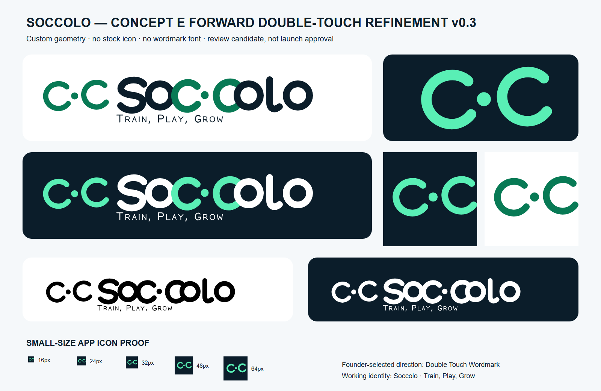

# Soccolo Concept E forward double-touch refinement — v0.3

Status: **provisional review candidate; not an approved launch identity**.

This directory contains the latest Section 4 asset and provenance bundle requested by [SP-076 brand assets and ownership decision](../../../decisions/SP-076-brand-assets-and-ownership.md). It applies Syed Ahmed's follow-up direction after v0.2: retain intentional `o`–`c` overlap, make both middle `c` forms open toward the right in reading direction, and enlarge the centre touch point. The result is controlled code-native geometry rather than a raster trace.

## Review first

Founder-supplied selected-detail reference:


Latest directed vector revision:



Primary review files:

- `soccolo-review-board.svg` and `.png` — combined comparison board;
- `soccolo-lockup-horizontal-light.svg` and `soccolo-lockup-horizontal-dark.svg` — primary lockups;
- `soccolo-symbol-primary.svg` and `soccolo-symbol-reversed.svg` — standalone symbol candidates;
- `soccolo-app-icon-1024.svg` and `.png` — full-bleed app-store source;
- `soccolo-export-intro-frame-16x9.svg` and `.png` — provisional fixed-navy export frame;
- `USAGE.md` — application rules, colour/spacing and minimum-size guidance;
- `PROVENANCE.md` — authorship, tools, source and rights record;
- `SIMILARITY-REVIEW.md` — preliminary collision screen and unresolved checks;
- `EXPORT-INTRO-STORYBOARD.md` — proposed composition handoff to SP-080; and
- `asset-manifest.json` — exact file sizes and SHA-256 checksums.

## Construction and reproduction

`build-assets.mjs` is the canonical editable geometry source. It uses only SVG paths, circles and rectangles defined in the repository. It contains both the custom Soccolo wordmark and a small custom vector alphabet for the tagline; no runtime or third-party font is used by the launch-candidate SVGs.

From this directory:

```powershell
node .\build-assets.mjs
powershell -NoProfile -ExecutionPolicy Bypass -File .\render-assets.ps1
node .\write-manifest.mjs
```

The PNG export script uses the locally installed Google Chrome SVG renderer and Windows image resizing for small/iOS exports. The SVG files are the masters; PNGs are deterministic review/delivery derivatives on the recorded machine.

## Approval boundary

Founder direction selection does not approve these files for launch. Approval requires review of the exact v0.3 files/checksums, resolution of the remaining double-C similarity warnings and a dated approve/revise/stop decision. The move away from the inward-facing v0.2 arrangement reduces the close Cuepri-device resemblance, but it does not itself clear the standalone mark. Trade-mark/legal clearance remains separate.
