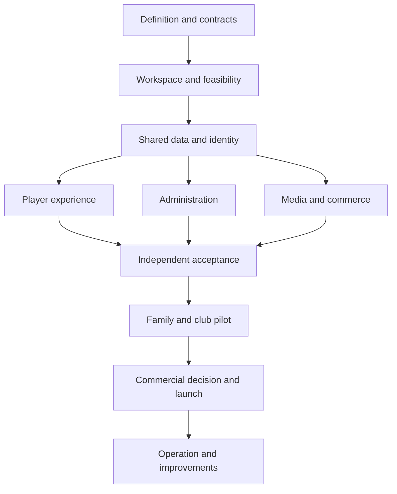

# SoccerTrainingApp — delivery master plan

> Synchronized 8 September 2026 from the [complete planning source](../../packages/soccer_agent_activity_package_20260908/docs/soccer_delivery_master_plan.md). This page contains the full source text with repository-relative navigation. Edit the canonical file under `packages/soccer_agent_activity_package_20260908/`, then run `node tools/sync-docs.cjs` from the repository root. Plain filenames, machine-data references and package regeneration commands in the source are relative to the [canonical package](../../packages/soccer_agent_activity_package_20260908/README.md).

Review edition • Updated 8 September 2026 • Planning and design only

**Latest planning revision:** The [agent activity plan](../delivery/soccer_agent_activity_plan.md) drills the requirements into 390 activities with explicit goals and handoffs. Section 8's five priorities are reconciled into SP-151–SP-165, existing task scopes, dependencies, all CSV variants and the acceptance register. The companion `soccer_product_wishlist.md` holds deferred enhancements. Earlier ZIPs remain dated snapshots.

This plan turns the existing product, security, administration and business specifications into a build sequence. It covers the first complete family-and-club product, commercial launch and ongoing operation. It does not commission development, create infrastructure, spend money, contact anyone or import issues into a live tracker.

The delivery package contains **12 phases, seven existing gate projects and 165 source issues**. SP-001–SP-150 are preserved; SP-151–SP-165 supply distinct priority contracts, implementation and verification. There are 42 acceptance containers and 123 leaves, decomposed into **327 agent activities, 21 human actions and 42 human acceptance rollups**. These counts describe planned work. Actual interfaces, owners, reviewers and run budgets must be resolved before assignment.

## 1. Read and use the package

| File | Purpose | Primary reader |
|---|---|---|
| `soccer_delivery_master_plan.md` | Scope, sequence, architecture, gate decisions and first actions | Founder / delivery owner |
| `soccer_human_action_playbook.md` | Concrete human actions, inputs, decisions and approval records | Founder and specialists |
| `soccer_agent_execution_playbook.md` | Task intake, implementation boundaries, evidence and handoff | Technical lead and agents |
| `soccer_delivery_backlog.md` | 165 detailed cards with human actions and agent work | All contributors |
| `soccer_agent_activity_plan.md`, `activities/` | 390 activity goals, deliverables, dependencies, completion checks and first assignment batch | Coordinator / agents |
| `soccer_agent_activity_manifest.json`, `soccer_agent_activity_tasks.csv` | Structured activity records and sortable planning view | Coordinator / agents |
| `soccer_feature_traceability.md` | Features, screens, risk/review references and verification coverage | QA / delivery / reviewers |
| `soccer_linear_setup_and_import.md` | Configure Linear and import without losing relationships | Workspace administrator |
| `soccer_linear_import.csv` | All 165 issue titles, descriptions and importable fields | Linear CLI importer |
| `soccer_linear_smoke.csv`, `soccer_linear_remaining.csv` | Alternative 3-record trial plus 162 remaining records | Import operator |
| `soccer_linear_manifest.json` | Structured issue data, parents, dependencies, phases and proposed run contracts | Integration / coding agents |
| `soccer_acceptance_evidence_register.json` | 613 planned criteria with blank evidence/reviewer fields and activity links | QA / reviewers |
| `source_manifest.json`, `baseline/` | Exact snapshots of seven prior plans and their hashes | Reviewers / agents |
| `validation_report.md` | Structural and file checks performed on this planning package | Delivery owner |

Use either the full CSV or the smoke-plus-remaining pair, never both routes for the same import. The JSON file is a project-specific manifest, not a native Linear JSON import format. The setup guide describes the second pass required for relationships.

The root backlog supersedes the earlier 74-record delivery breakdown. Product contracts remain in the baseline files. The latest design pack section 9 governs light/dark appearance and logo export over older visual concepts. Material changes to product or security requirements must be recorded, reviewed and propagated to affected tasks; this plan does not silently relax them.

## 2. Product that the first release must deliver

| Area | Agreed baseline / planned outcome | Readiness evidence |
|---|---|---|
| Audience | Ages 5–18; age suitability separate from ability; adult control at 18 | Reviewed flows and content for each released age/ability combination |
| Routes | Standalone families and club-managed activities | Both routes work through onboarding, training, sharing and departure |
| Hierarchy | Level 0 platform; Level 1 club or parent; Level 2 coach; Level 3 player | Enforced action/resource matrix, not a numerical superuser inheritance |
| Coach content | Create/propose additional drills; add/remove/reorder/replace and assign by age/team/player | No twelve-drill application limit; qualified approval and immutable history |
| Training | Programs, positions, library, realistic demonstrations, cues and work/rest timers | Coach-approved assets and coherent offline sessions |
| Recording | In-app camera, exercise clips and full session with chapters | Device evidence for simultaneous preview/demo/timer/capture and interruptions |
| Replay / export | Own authorized source footage and reference comparison; logo intro then footage on export | Local source preserved; timeline, audio, permissions and export failures tested |
| Appearance | Navy/mint Light and Dark, following phone/browser preference by default | Both themes across all screen states; switch does not reset recording |
| Storage | Device-local history/files; optional private cloud backup | Honest copy state, quota, retention, deletion and recovery evidence |
| Administration | Responsive web for parent, coach, club and platform workflows | Scoped rosters, planning, calendar, attendance, feedback and support |
| Identity | Adult TOTP, restricted player credentials, defined recovery and step-up | Direct API and shared-device attempts cannot bypass authority |
| Business | Family and club subscriptions, included invited coaches, support and operations | Verified purchase-source ledger, approved catalog and funded service coverage |

Australia/English, exact assistance expectations, commercial prices and quotas still require the recorded decisions in the existing plans. The former proposals—Family AUD 14.99/month or 119.99/year, Club AUD 5/player/month or 48/player/year, 25-seat minimum, 20 GB family and 5 GB/player pooled club storage, 30-day active retention—are **planning assumptions**, not approved offers or current vendor quotes. Resolve through SP-001, SP-048, SP-057 and SP-148. Do not use prototype prices as live products.

The first commercial release does not include a public child social network, unrestricted direct messaging, talent prediction, automatic technique scoring, live rotatable 3D rendering, a coach marketplace or an unattended agent dispatcher. They require their own justified scope and verification. Independent Coach Pro and storage add-ons remain evaluation items. Ordinary skill growth is not a guarantee of a football career.

## 3. Technology and ownership boundaries

This is the current planned stack from the existing architecture documents, carried forward for delivery. Feasibility and current provider review must confirm the exact versions, capabilities, licensing and costs before procurement.

| Component | Planned technology / location | Responsibility and boundary |
|---|---|---|
| Mobile | Flutter/Dart; iOS and Android | Player experience, camera, clock, demonstrations, local files and sync |
| Device database | Drift over SQLite, worker outside UI work | Protected per-context records/outbox; video files stored separately; SQLite is not inherently encrypted |
| Camera / demo | Flutter camera and video playback adapters; native extensions if proven necessary | One session controller owns state; adapters report actual success/interruption |
| Branded export | On-device composition approach selected in SP-081 | Encode logo first, preserve source and correctly transform export offsets; no presumed render farm |
| Adult portal | Next.js/TypeScript; Vercel with intended Australian server placement | Server-mediated adult session; no broad browser service credentials or public caching |
| Domain backend | Supabase PostgreSQL, Auth and constrained APIs; intended Sydney primary | Current authority, versioned content, entitlements, grants, quotas and record lifecycle |
| Private media | Quarantine then authorized private object storage | Only server-validated media becomes readable; short-lived access has residual limits |
| Jobs / recovery | Scoped queue workers; separate restricted recovery copy in intended AWS Melbourne | Bounded validation/backup work, retries, retention and restoration; database backup alone is insufficient |
| Purchases | RevenueCat/store integrations; Stripe web/club billing | Verify sources centrally; billing owner, beneficiary and viewing rights remain distinct |
| Content | Blender/approved production pipeline and licensed reference footage | Pre-rendered demonstrations; qualified approval of actual motion/assets |
| Delivery | Linear, GitHub, secured CI, named reviewers | Linear records work; repository/CI hold versioned changes and evidence; people accept gates |

The phone owns an active training session. Loss of internet must not stop a downloaded local drill or corrupt a recording. New privileged operations still require current server authorization. A paid entitlement expiring mid-recording does not erase the footage or abruptly terminate capture. Offline revocation and content withdrawal have the documented freshness limits; do not promise remote control of an offline phone.

Proposed repository areas are `apps/mobile`, `apps/web`, `backend`, `workers`, `contracts`, `content`, `infra`, `tests` and `docs`. They are logical boundaries for future work, not existing source folders. Do not maintain separate contradictory business rules in mobile and web. Keep schemas, contract fixtures, content versions and consent vocabulary aligned.

## 4. Phases and gate mapping

| Phase | Outcome | Existing gate project | Primary completion / integration issues |
|---|---|---|---|
| P00 | Definition, accountable owners and discovery budget | G0 Definition/setup | SP-001, SP-003, SP-004, SP-075 |
| P01 | Experience, coaching, security and system contracts | G1 Contracts | SP-005–SP-011, SP-037–SP-038, SP-047–SP-050, SP-059–SP-064 |
| P02 | Private workspace and controlled agent trial | G2 Feasibility | SP-002, SP-012, SP-013, SP-146 |
| P03 | Technical proof and full-build decision | G2 Feasibility | SP-014–SP-018, SP-039, SP-051–SP-052, SP-065, SP-081 |
| P04 | Shared records, identity and offline foundation | G3 Pilot build/verification | SP-021, SP-040, SP-053, SP-066 |
| P05 | Learning, recording, replay and branded export | G3 Pilot build/verification | SP-019, SP-020 |
| P06 | Family/coach/club/platform workflows | G3 Pilot build/verification | SP-041–SP-045 |
| P07 | Cloud media, sandbox commerce and operating systems | G3 Pilot build/verification | SP-023–SP-025, SP-027, SP-055; sandbox children of SP-054 |
| P08 | Independent verification and pilot acceptance | G3 Pilot build/verification | SP-026, SP-028, SP-067–SP-071 |
| P09 | Family and club pilot, corrections and commercial evidence | G4 Pilot | SP-029, SP-030, SP-046, SP-057 |
| P10 | Approved catalog, business readiness and launch | G5 Commercial release | SP-031–SP-034, SP-054, SP-056, SP-072–SP-074 |
| P11 | Operation, maintenance and justified expansion | G6 Operations | SP-035, SP-036, SP-058 |

Gate projects preserve the original G0–G6 taxonomy. Put issues into their recorded gate project and a local phase milestone; use phase labels to group across projects. A phase can have early contracts or sandbox work serving a later gate. In particular, SP-120–SP-122 build sandbox commerce during P07; production catalog acceptance and SP-054 completion remain P10 obligations. Parent/child links may cross those projects; import relationships after both ends exist.

This is a planning dependency structure, not authorization to run parallel agents. Follow the issue-level graph and current workspace policy. Content production can overlap implementation after its specifications and rights are settled. Integrate vertical journeys frequently rather than waiting for all subsystems to finish.

## 5. Detailed phase instructions

### P00 — Establish the baseline and people

**Human actions:** resolve launch geography/language and assistance assumptions; preserve ages 5–18, both recording modes and both family/club routes. Name accountable technical, coaching, safeguarding, privacy, operations and release people, including a genuine alternate operator. Agree a discovery budget and explicit spending/contact authority. Resolve brand ownership separately from software hosting.

**Agent work:** organize the decision register, list unresolved assumptions, prepare scoped briefs and map existing requirements. Suggest narrower choices where the evidence supports them; never insert invented quotes, owner acceptance or user research.

**Outputs / exit:** approved product baseline, owner map, scoped discovery budget and evidence policy. Planning items may be refined now. Actual account creation, supplier engagements and development start only within the applicable commissioned scope. Reuse existing authorization once recorded.

### P01 — Complete contracts, prototypes and coaching inputs

**Human actions:** qualified coach reviews twelve drill families and each proposed released variant, including goalkeeper expertise where needed. Animator produces and revises three representative samples before committing to the full asset catalog. Designer completes editable F01–F33 flows in both themes; research owner tests comprehension using example data. Privacy/security specialists review the actual data/identity/store model and recovery procedure.

**Agent work:** formalize schemas, authority matrix, session state machine, offline conflict rules, content manifest and entitlement lifecycle. Prepare paired component requirements and executable future acceptance scenarios. Specify logo-first export: two seconds/fade is a proposal; original audio exists only if microphone capture was enabled. Define original recording time, active practice time and exported video time separately.

**Outputs / exit:** versioned contracts, signed content decisions for samples, complete asset inventory, actionable design states, threat/retention/region/identity contracts, revised specialist estimates and measurable device targets. Missing brand, coach approval or content assets remain explicit blockers for the affected deliverable. A generated concept is not a completed Figma prototype.

### P02 — Establish the controlled development workspace

**Human actions:** create or select actual organization-owned accounts/repository, designate reviewers and protect release credentials. Configure the tracker and map roles to real people without sending invitations implicitly. Approve development/staging budgets and which agent integration may access which team/repository.

**Agent work:** after the build scope is commissioned, prepare reproducible repository setup, pinned dependencies, CI and synthetic fixtures. Verify one tiny agent task from claim through evidence and independent acceptance. Demonstrate that failed checks and malicious issue text cannot change destination or bypass protections.

**Outputs / exit:** private repository, isolated non-production configuration, working CI, bounded task contract and observed integration limits. No production secrets or real child records in preview/PR jobs. Do not assume purchasing a tool automatically enables enforceable review gates; prove the chosen configuration.

### P03 — Prove the difficult combinations

**Human actions:** set thresholds before testing, provide actual iOS/Android devices and lawful adult fixtures, review failures and choose the minimum supported device promise. Accept or reject the feasibility package before funding the full build.

**Agent work:** prove simultaneous camera, demo, clock and cues; exercise/full-session capture, chapters and interruption recovery; branded composition; scoped database policies; local migration/outbox reconnect; MFA/player credentials; private upload; sandbox purchases. Keep scope to evidence and contracts, not polished commercial features. Record latency, storage, thermal behaviour, recovered parts and failure cases using actual measurements.

**Outputs / exit:** SP-018 acceptance packet with device evidence, implementation approach, remaining constraints and revised engineering/content/security/cost estimate. A proposed 30-minute capture test evaluates the device, not a recommended child session duration. Unsupported combinations require an explicit fallback or exclusion. A desktop demo cannot establish native camera feasibility.

### P04 — Build shared records, identity and device persistence

**Human actions:** technical lead reviews schema ownership and migrations; privacy owner approves guardian/dispute/retention cases; identity owner accepts recovery and restricted-player credentials. Resolve account recovery before protected cloud onboarding.

**Agent work:** implement staged database migrations and policy fixtures; build adult and player credential contexts, enrollment/challenge/recovery/revocation, household/club links, local repositories and idempotent sync. Test direct API, joined references, sibling devices, account switches and stale events. Establish server-authoritative permissions and purchase truth while keeping append-only device session facts.

**Outputs / exit:** integrated foundation with reproducible seed data, tested isolation, actual MFA and local migration/reconnect evidence. Empty tables alone are not a working application database. Use synthetic identities until the pilot gate allows real data.

### P05 — Build the complete player journey

**Human actions:** coach approves every released media asset and cue; designer validates youngest and mature-player instructions, recording controls and both themes. Product owner accepts the actual recording/export promise observed on supported devices.

**Agent work:** discover → learn → download → prepare → countdown → work/rest → pause/stop → save → review → export. Implement one controller and separate camera/demo/export adapters. Work time starts after confirmed capture where recording is selected. Programmed rests remain recorded in full mode; interruption gaps remain visible. Use local source offsets for review and derived offsets for exports. Implement Follow device plus manual Light/Dark without restarting capture. Add no-camera practice and truthful storage/finalization states.

**Outputs / exit:** SP-019/SP-020 complete against the approved catalog, both modes and on-device export. Export starts with the approved logo and proceeds to footage; no automatic burn-in of the timer/demo. A requested external save/share remains a deliberate authorized action; local source is preserved.

### P06 — Build administration and plan governance

**Human actions:** coach and club coordinator review roster fields, plan editing, attendance and structured assessment. Privacy/safeguarding owners review sharing, reports, departures and adulthood. Parents retain authority over consent independently of club billing.

**Agent work:** build server-mediated web sessions, responsive Light/Dark shells, expiring invitations, enrollment, teams, coach scope, plan/drill authoring, review/publish, schedule/assignment/attendance, progress and parent review. Publishing validates each recipient and exact asset version. Ordinary plan changes affect future versions, not active recording. Prevent cross-workspace joins and unauthorized exports.

**Outputs / exit:** standalone-family and club-sponsored flows both work. A coach can use more than twelve drills without publishing unreviewed material. Reports distinguish participation from demonstrated skill and do not make private footage visible by default.

### P07 — Integrate media, commerce and operations

**Human actions:** agree actual service limits and region/processor disclosures; approve message recipients, retention and backup authority. Operators set measurable alert/recovery thresholds and backup coverage. Billing owner approves sandbox cases and product vocabulary; live products remain a P10 decision.

**Agent work:** implement upload reservation, quarantine validation, private playback, grant expiry, deletion/suppression, jobs, recovery manifests and redacted telemetry. Connect production-shaped sandbox entitlements, adult purchase/restore routes and club seats. Verify provider-event replay/out-of-order handling and reconcile without duplicate privileges or charges. Instrument actual cost drivers, including export CPU/time, validation, recovery, storage, playback and support.

**Outputs / exit:** verified cloud copy states, queue/error ownership, recovery evidence and integrated sandbox billing. Child consent, a sponsor's payment and a media grant remain separate records. No paid participant trial is implied. Active footage remains local until authorized backup.

### P08 — Verify and accept pilot readiness

**Human actions:** independent reviewers inspect current mobile, web, APIs, storage, jobs, billing and pipeline. Coach verifies full release content; safeguarding lead verifies report routing; operator rehearses incident/restore with an alternate. Founder, coach and technical lead accept the exact pilot scope only after blockers close.

**Agent work:** run focused integrated and adverse-case evidence, classify failures, repair within scope and rerun affected tests. Trace all F01–F33 and S01–S27/R01–R20 obligations. Produce a release candidate manifest and test evidence tied to it. Do not use stale CI evidence after subsequent changes.

**Outputs / exit:** SP-028 accepted on actual build/config/content versions, permitted participants, support cover and metrics. Security/privacy/content blockers for the proposed pilot cannot be deferred merely to start the pilot sooner. This is verified readiness within scope, never a hack-proof guarantee.

### P09 — Run the family and club pilot and correct failures

**Human actions:** recruit through authorized contacts, obtain appropriate guardian consent/child assent or adult consent, and observe family plus club workflows. Explain research versus product recording and use approved data handling. Measure setup friction, reliability, drill comprehension, coach workload, support burden, retention/storage and adult willingness to pay.

**Agent work:** summarize de-identified data, calculate metrics with denominators, turn observed failures into bounded correction issues and reproduce technical problems using safe fixtures. Retest corrections and update the cost model with real usage. Do not infer validated technique improvement from a small usability sample.

**Outputs / exit:** SP-030 decision: proceed, revise or stop; clear supported scope, remediations, price/usage evidence and revised budget. Both routes must pass before both are marketed. If release is staged, founder must approve the explicit scope change and communications.

### P10 — Prepare the business and release

**Human actions:** approve production catalog, terms, ownership/IP and specialist business obligations; staff support/refund/recovery and safeguarding response. Verify current store/SDK requirements against actual behaviour. Accept funding/runway and authorize exact release audience/build/config. Store submission, review, approval and public availability are distinct statuses.

**Agent work:** finish authorized production configuration preparation, commerce verification, public help/pricing pages, release manifests, compatibility checks and staged smoke tests. Assemble traceability and go/no-go packets. Prepare artifacts before release-owner acceptance; do not publish automatically because a PR merged.

**Outputs / exit:** SP-034 closes only after current SP-074 evidence, human release decision, actual authorized publication status and limited-rollout checks. Mobile updates cannot be assumed instantly reversible. Customer subscriptions must not launch before support and incident ownership exist.

### P11 — Operate and improve

**Human actions:** own review cadence, incident decisions, content changes, renewals, budgets and customer communication. Maintain an alternate operator and proportionate independent security review. Decide expansion from demand and cost evidence.

**Agent work:** execute dated maintenance/analysis tasks within scope; collect health/cost signals, prepare dependency changes and drift reports, improve verified product gaps. Use recurring issue templates only when actually configured. Evaluate a durable dispatcher if demonstrated repetitive volume warrants it; native manual delegation is sufficient initially.

**Outputs / exit:** there is no permanently completed operations phase. Each dated occurrence has its own evidence and closure. Maintain portability and an eventual service-exit plan for data, customer communication and billing. New markets or automated technique assessment reopen privacy, content, safety and technical evaluation.

## 6. Delivery cadence and estimating

Use a weekly review and one- or two-week implementation cycles as a starting proposal. Select only dependency-ready work that fits available review capacity. Start with one or two active implementation leaves and one review lane; expand only after SP-013 demonstrates reliable task handling. This is a future operating proposal, not an instruction to spawn agents now.

| Work | Initial scheduling treatment |
|---|---|
| P00 | Short, bounded decision stage; resolve people and budget before commitments |
| P01 and P02 | Design/content/security and workspace setup can overlap where their own prerequisites permit |
| P03 | Timeboxed experiments with thresholds fixed in advance; failures inform SP-018 |
| P04 | Establish shared interfaces and fixtures before conflicting implementations begin |
| P05–P07 | Overlapping feature work after contracts; integrate a full journey each cycle |
| P08 | Reserve independent reviewer and device access early; not leftover time |
| P09 | Recruit in advance of the authorized pilot, but do not collect practice data before readiness |
| P10 | Include store review and specialist lead times as uncertainty, not guaranteed dates |
| P11 | Fund maintenance and support as ongoing work |

A defensible calendar and total build budget follow SP-018, using actual owners, capacity, quotes and feasibility results. The previous family-focused and later expanded estimates are not commitments for this refined backlog. Use three-point effort estimates on leaf tasks after interface inspection; keep dependency wait and specialist lead time separate. Do not sum work-package estimates plus their children or turn story points into elapsed days without evidence.

Report accepted leaf deliverables, blocked decisions, oldest blocked age, review queue, gate evidence, device failure metrics and actual spend. Show work packages separately. Code volume, messages and agent-reported completion percentages are not release evidence.

## 7. Immediate sequence

1. Read this plan and assign the owner roles in the human playbook. Resolve SP-001 and SP-075; SP-003 can be refined independently.
2. Close the discovery budget and scope in SP-004, then start coach/content/design/identity contract work. Record unresolved choices rather than inventing approvals.
3. Load the backlog using the setup guide into the actual chosen workspace when you authorize that setup. Name humans before delegating.
4. Commission the bounded environment and feasibility work in P02/P03. Demonstrate one controlled task before broader agent execution.
5. Accept SP-018 and a revised estimate before funding the full P04–P10 build.

The files are ready for review and import preparation. No task has been marked Done merely because this plan describes it.

## 8. Immediate product priorities and wishlist — 7 September 2026

Following the competitive gap analysis, prioritize the five improvements below in requirements and prototype work now. Their implementation follows the existing development authorization, contracts, feasibility and evidence gates. This update does not commission coding, obtain coach approval or expand the pilot into every competitor feature.

The priority order balances educational value, usefulness to families and clubs, and implementation effort. Structured learning comes first; guidance and assessment make progress understandable; feedback makes recording useful; supportive goals help players return. These improve the central practice journey rather than adding another product category.

### IP-01 — Complete coach-approved learning pathways

**Priority 1. Market findings:** MG-01, MG-10, MG-16. **Phases:** design P01; assets/player delivery P05; validation P08/P09.

**Pilot scope:** organize the twelve drill families into a coherent foundation sequence with suitable age/ability variants. Every released path states its learning goal, entry requirements, ordered activities, easier alternatives, progression conditions and what to do afterwards. Include short parent guidance for setup and encouragement. Advertise only the actual reviewed coverage; twelve remains a pilot catalog size, not an authoring limit.

**Human action:** qualified coaching lead approves sequence, supervision, prescriptions and progression. Content lead accounts for all required demonstrations, captions and cues, with production cost and review ownership.

**Agent build scope:** connect existing catalog/program/version records and display eligible paths; reject missing or withdrawn variants. Agents may structure approved content, not invent coaching approval or training prescriptions.

**Acceptance:** every offered pathway has a usable start, sequence and next step; no empty paid pathway; older beginners receive suitable language; released assets match approved versions.

**Existing task homes:** SP-005, SP-006, SP-096, SP-114, SP-125. **Evidence:** SP-070, SP-130, SP-137. **Cost:** SP-147. Full position-specific curriculum expansion is a later scope decision, not an immediate requirement to produce hundreds of drills.

### IP-02 — A clear recommendation for the next session

**Priority 2. Market finding:** MG-02. **Phases:** rules/prototype P01; player implementation P05; club integration P06.

**Pilot scope:** Today presents one suitable next activity with a short explanation, considering the approved pathway, ability evidence, time, equipment, space, assistance and current assignments. Let the authorized adult/coach choose an approved alternative. Where information is missing or assignments conflict, explain the issue; do not silently combine workloads.

**Human action:** coach and product owner approve deterministic rules and precedence between home and club activity. Define what the user can change and when reassessment is appropriate.

**Agent build scope:** implement a versioned ruleset using approved catalog data, including a valid offline fallback. No generative training prescription or automatic increase in workload is included.

**Acceptance:** suitable fixtures cover no equipment, limited time, a missed session, a younger advanced player, an older beginner and conflicting club assignments. Each case returns an eligible next step or an understandable reason none is available. Completion alone does not increase assessed skill.

**Existing task homes:** SP-086, SP-096, SP-113, SP-115, SP-116. **New distinct leaves:** SP-152 defines the rules; SP-157 implements the evaluator and Today integration. **Evidence:** SP-165, SP-127, SP-137, SP-138.

### IP-03 — Repeatable personal skill checks

**Priority 3. Market finding:** MG-03. **Phases:** coaching protocol P01; record/UI delivery P04–P06; validation P08/P09.

**Pilot scope:** a small coach-selected set of repeatable assessments tied to the foundation pathway. Store protocol/version, setup, result, source, assistance and relevant conditions. Compare a player with their own comparable previous attempts; show practice participation separately. Camera footage is optional.

**Human action:** coach defines valid/invalid attempts, safe conditions, permitted assistance, retest intervals and the limits of parent observation. Do not invent age norms or professional potential scores.

**Agent build scope:** extend attributed assessment records and personal progress views with comparability rules, correction history and no-result states.

**Acceptance:** matching protocols can be compared; changed conditions are flagged; parent-reported and coach-observed results remain identifiable; a completed timer never automatically certifies technique. An unrecorded attempt can still receive a legitimate attributed assessment.

**Existing task homes:** SP-005, SP-086, SP-098, SP-116. **Evidence:** SP-070, SP-127, SP-139. Automated camera scoring stays on the wishlist.

### IP-04 — Close the coach feedback loop

**Priority 4. Market finding:** MG-06. **Phases:** workflow design P01; delivery P05/P06; workload validation P09.

**Pilot scope:** a guardian/adult can deliberately submit a permitted attempt to an assigned coach. The coach has a queue with submitted, reviewed and withdrawn states, can leave one structured improvement cue, and can link an approved follow-up activity. Show the player an age-appropriate next action. Text-only feedback on assigned practice remains possible without video.

**Human action:** club/coach owner defines responsibility, capacity, clip limits and expected response window. Safeguarding/privacy owner approves visibility and reporting rules. Included coach accounts do not imply unlimited platform-paid coaching labour.

**Agent build scope:** add submission state, authorized review queue and linked feedback/assignment records using existing media grants. Notifications contain minimal information. Timestamped annotations are optional refinement, not necessary for this minimum loop.

**Acceptance:** a submitted attempt can receive an actionable cue and follow-up; withdrawal/expiry blocks new video access; access checks cover queue previews as well as playback; review time is measured; there is no unrestricted private adult–child chat.

**Existing task homes:** SP-098, SP-104, SP-116, SP-117, SP-119. **Evidence:** SP-128, SP-138. **Cost:** SP-147. Platform-provided mentoring and marketplace services remain deferred.

### IP-05 — Healthy weekly goals and personal milestones

**Priority 5. Market finding:** MG-04. **Phases:** design P01; delivery P05–P07; behavior validation P09.

**Pilot scope:** an optional weekly practice goal within approved guidance, private completion milestones, adult-configured reminders and a supportive return after a break. Keep the first version simple: no points economy, public rankings, physical reward fulfillment or competitive minutes target.

**Human action:** coaching/product leads approve goal limits, language, reminder defaults and treatment of rest, stopping early and missed weeks. Families can opt out without losing training access.

**Agent build scope:** implement goal/milestone state and quiet-hour-aware reminders through existing progress and notification services. Prevent duplicate rewards/messages after retries or synchronization.

**Acceptance:** resting or missing a week does not erase earned milestones or trigger pressure; stopping remains immediate; no goal requires recording/uploading footage; private progress stays within authorized contexts. Evaluate useful return behavior rather than time spent looking at the app.

**Existing task homes:** SP-077, SP-096, SP-116, SP-119. **Evidence:** SP-070, SP-130, SP-139.

### Baseline work that remains essential

These five priorities do not replace camera/timer feasibility, both recording modes, logo-first export, device-following Light/Dark, offline storage, security/MFA, family/club isolation, consent, deletion, subscriptions, support or commercial validation. Those already have explicit delivery work. Core rosters and invitations remain baseline scope even though advanced imports/integrations are wishlisted.

### Wishlist and task reconciliation

Use [soccer_product_wishlist.md](soccer_product_wishlist.md) for deferred candidates, their value, revisit triggers and promotion requirements. A wishlist entry has no promised release date and is not permission to build or spend.

The 8 September activity revision reconciles IP-01–IP-05 into the task package. SP-151–SP-155 specify the five contracts; SP-156–SP-164 implement their bounded extensions; SP-165 verifies the integrated priority journeys. Existing task homes retain their original criteria and gain explicit integration/interface obligations. The register now has 613 planned criteria, preserving the original 543. All three source CSVs are regenerated from the same manifest. The five IP records remain requirement references, not live issue IDs. Preserve actual approvals and Linear IDs during any subsequent live update.

Use the [activity plan](../delivery/soccer_agent_activity_plan.md) and its first assignment batch for the next level of work. Every source task maps to activity IDs with goals, inputs, deliverables and completion checks. Actual named assignments, predecessor acceptance, target paths and budget are still required before an implementation run; this planning revision does not start development.

At the next existing scope/estimate review, assess the minimum versions of these five priorities together. Wishlist promotion requires observed demand, a scoped design, rights/security review where relevant, cost/review capacity and concrete acceptance evidence. Recorded authorization remains valid; routine refinements within it do not need repeated permission requests.
