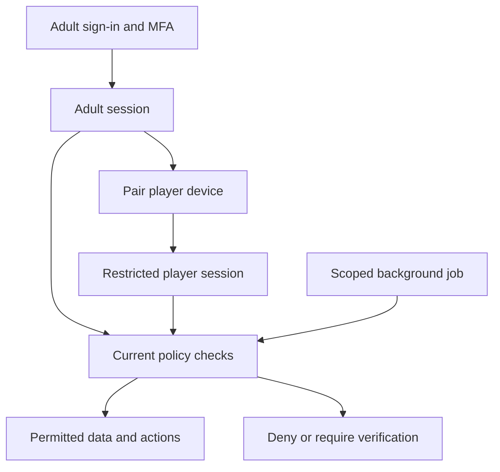

**Soccer app — end-to-end security and gap review**

Review edition: 6 September 2026. Scope: all six soccer planning documents and all seven sheets of the subscription/cost workbook. This reviews the mobile, web, cloud, identity, media, coaching, subscription, delivery and business workstreams. It does not claim to review unrelated projects, a code repository or live infrastructure. There is no working app or database to test. No application code, accounts, MFA settings or cloud resources were created by this review.

**1. Assessment and the 2FA decision**

The architecture is suitable to take into detailed design and feasibility. It is not ready to accept children's data. Earlier documents require privileged-user MFA in S09/S21, but leave its methods, coverage, recovery and enforcement incomplete. This review makes those requirements concrete and identifies 20 review actions, R01–R20. They elaborate the existing 27 security risk themes and include delivery/business gaps; they are not 20 newly discovered exploitable vulnerabilities. All implementation and verification actions remain open.

**Use authenticator-app 2FA.** Support Google Authenticator and Microsoft Authenticator through standard time-based one-time passwords (TOTP). An adult first signs in, then enters the six-digit code from their authenticator when the policy requires it. Supabase provides TOTP enrollment/challenge/verification and an assurance claim that must be enforced by the backend and database, not just the screen. [Supabase MFA](https://supabase.com/docs/guides/auth/auth-mfa), [TOTP setup](https://supabase.com/docs/guides/auth/auth-mfa/totp).

Microsoft Authenticator accepts non-Microsoft accounts by scanning their QR code. This is its code-generator mode; generic app support does not provide Microsoft's work-account push approvals or number matching. Google Authenticator can generate codes offline; the app still needs a connection to verify a fresh login. [Microsoft setup](https://support.microsoft.com/en-us/authenticator/how-to-add-your-accounts-to-microsoft-authenticator), [Microsoft Authenticator FAQ](https://support.microsoft.com/en-us/authenticator/microsoft-authenticator-faqs), [Google Authenticator](https://support.google.com/accounts/answer/1066447?co=GENIE.Platform%3DAndroid&hl=en).

Email verification, an emailed sign-in code and “Sign in with Google/Microsoft” are distinct from this second factor. Do not let a second email code satisfy the application's MFA requirement or assume social login proves upstream MFA. Keep email for verified contact, ordinary sign-in where selected, and security notices. NIST does not accept email as an out-of-band authenticator in its assurance model; its separate treatment of email validation/recovery should not be misrepresented as a ban on all email use. This project uses that guidance as a security reference, not a certification claim. [NIST authentication guidance](https://pages.nist.gov/800-63-4/sp800-63b.html).

| Identity / activity | Required policy in the proposed app | Convenience and boundary |
|---|---|---|
| Level 0 platform administrator | MFA before any platform operation; TOTP is the pilot minimum. Require a verified phishing-resistant staff entry method before commercial platform administration | Named individual account; separate everyday identity where practical; no shared super-admin login |
| Level 1 club administrator | Mandatory TOTP before roster, staff, billing or plan administration | Fresh verification for role changes, sensitive exports and consequential billing changes |
| Level 2 coach | Mandatory TOTP before accessing assigned children, feedback or private shared footage | Qualification, assigned scope and viewing grants remain additional requirements |
| Level 1 parent/guardian | Offer MFA at setup; require enrollment and MFA before enabling cloud, accessing private cloud media, sharing, guardian-link changes or other sensitive account controls | Local-only starter practice need not require authenticator enrollment. Once enabled, new adult sign-ins require MFA; do not prompt at every drill |
| Level 3 adult player, age 18 | Same cloud/sensitive-account MFA requirement as a parent, for their own information | Family payment never preserves parental access automatically |
| Level 3 child player, under 18 | A guardian-provisioned, restricted player/device session; no requirement for the child to own an email account or authenticator | Cannot administer staff, guardians, billing, MFA or media grants. Stop remains immediate, including offline |
| Operators' vendor accounts | MFA on cloud, source control, billing, email, domain registrar, design and tracker accounts wherever available | Prefer phishing-resistant methods where supported; document actual provider capabilities and a separately held backup factor |
| Jobs and agents | Scoped service identities and short-lived credentials where supported | Human 2FA is not a substitute for machine-identity restrictions; no automated approval of MFA prompts |

TOTP improves account security but is susceptible to phishing. Supabase now documents passkey support as **experimental**, including native clients. Do not assume a passkey automatically satisfies the app's MFA/recency rules. Before adopting it, prove user verification, origin binding, enrollment/recovery, token assurance mapping and fallback behavior. Use a supported workforce identity/access solution if needed for the commercial Level 0 requirement; price it in the revised estimate. An unproven experimental method cannot silently replace the TOTP baseline. [Supabase passkey status](https://supabase.com/docs/guides/auth/passkeys).

**2. Enrollment, recovery and factor changes**

The normal enrollment sequence is authenticated adult → explain the method → display a short-lived enrollment QR/manual secret → verify an initial code → record successful enrollment → offer a separate backup factor → enter the authorized adult area. QR codes and secrets must not enter logs, analytics, screenshots used as ordinary evidence, support tickets or agent prompts. On a single phone, provide a deliberate manual/import setup route because the user cannot point the same phone at its own screen. Verify accessibility and clipboard behavior on supported devices.

Require recent verification of an existing factor before adding/removing a factor, changing a recovery contact, linking a new sign-in identity or weakening the policy. Initial enrollment is a narrow exception for an account without a factor; it must not expose protected data before verification. Keep a server-owned requirement flag for protected roles so removing the last factor does not restore single-factor access. A newly promoted coach remains in enrollment-only access until ready.

Supabase's client MFA reference states that recovery codes are not supported and that multiple TOTP factors are supported. Its administrative API can remove a lost factor, but that API is a privileged recovery mechanism, not an identity-proofing process. The separate Supabase dashboard account also needs its own backup-factor preparation. [Client MFA limitations](https://supabase.com/docs/reference/swift/auth-mfa-api), [administrative factor removal](https://supabase.com/docs/reference/python/auth-admin-mfa-deletefactor), [dashboard MFA](https://supabase.com/docs/guides/platform/multi-factor-authentication).

Use the following initial recovery contract:

1. **Available backup factor:** authenticate with it, add a replacement, verify it, then remove the lost factor. A backup held on the same lost phone is not sufficient device-loss recovery.
2. **All factors lost:** open a restricted support case without disclosing the account's children or media. Email access alone, a payment receipt, knowledge of a child's name, or approval by a coach is insufficient proof for a reset.
3. **Verification:** a trained human follows an approved, proportionate identity/authority procedure using previously established evidence. Record the decision and reviewer, minimize collected documents and never ask for passwords, live authenticator codes or seed secrets. Platform/staff recovery requires a second authorized approver; the sole founder cannot invent that approver.
4. **Containment and notification:** notify established contacts of a recovery attempt where safe, suspend consequential account changes during review, revoke affected application sessions/device grants, and record the remaining JWT/link/offline limitations. Safeguarding cases require special handling so notices do not alert the alleged abuser automatically.
5. **Re-enrollment:** a successful recovery provides a short-lived enrollment-only route. The user establishes and verifies a new factor before child data or administrative powers return. A password reset or factor deletion must not bypass this state.

If a usable, defensible recovery process cannot be demonstrated, protected cloud onboarding does not pass its gate. Do not improvise a helpdesk override during a live incident. Custom single-use recovery codes are a possible separately reviewed feature, not a native capability to promise or a reason to invent cryptography. [OWASP MFA recovery guidance](https://cheatsheetseries.owasp.org/cheatsheets/Multifactor_Authentication_Cheat_Sheet.html).

**3. Child sessions, adult sessions and step-up enforcement**

The most consequential architectural gap is the adult-to-child handoff. A child-mode switch must not keep using a parent's fully authorized token. Specify two distinct credential contexts: an adult session for account management and a restricted player/device session for practice. An enrolled parent provisions the player device through an expiring pairing process. The backend issues or brokers a credential limited to that player, device and permitted actions. The implementation choice must be proved with the selected Supabase/Flutter integration; it is additional engineering, not an automatic feature of a player profile.

Child credentials may read their permitted plans, append practice events and perform authorized upload operations under an already established guardian policy. They cannot turn cloud on, change a recipient, read siblings' private data, create a guardian, become a coach or retrieve adult credentials. Standing guardian consent permits bounded background work; a worker must still check current consent, session/device validity, deletion and quota. Do not require an unattended worker to enter human OTPs, and do not exempt it from authorization.

On a shared phone, clear adult access from ordinary memory at handoff and protect any retained adult refresh credential behind the separately verified adult boundary. Biometrics or a local PIN can unlock an established adult session where appropriate, but an enrolled child biometric or a shared device passcode is not proof of guardianship. New grants, recovery and consequential changes require server verification. A dedicated child phone must not contain the parent's reusable refresh token. Local profile switches must not expose another player's media or return automatically to a privileged area after an app restart.

**Proposed session targets — validate before deployment:**

| Control | Starting target | Enforcement requirement |
|---|---|---|
| Access JWT | 15-minute lifetime | Verify signature, issuer, audience, expiry and intended application; never trust decoding alone |
| Underlying adult login session | At most 30 days absolute, seven days without refresh | A base session does not preserve privileged activity indefinitely; provider settings and application controls must agree |
| Staff privileged workspace | 15 minutes of actual inactivity; eight hours maximum before reauthentication | Server-enforced privileged-session state; background token refresh is not user activity |
| Parent/adult management workspace | 30 minutes of actual inactivity; eight hours maximum | Lock management controls; let an active local recording finish safely |
| Consequential changes | MFA/approved equivalent verified within five minutes | Bind the verified action to current actor/session and purpose; refreshing a JWT is not fresh MFA |
| Player online credential | Short-lived, renewable only within current player/device grant | Revocation and scope checked at renewal and protected operations; no parent privilege |
| Offline prepared practice | Existing maximum seven-day content/entitlement policy, with shorter safety freshness where needed | This is a local-use allowance, not an adult authenticated session or remote-revocation guarantee |
| New signed media URL | Maximum five minutes proposed | Verify current grant before minting; test range requests/renewal. Previously downloaded bytes cannot be retracted |

Supabase's normal session defaults are not these role-specific policies. Its session limits are checked during refresh, and already issued JWTs can outlive sign-out. Sensitive requests therefore need current session/revocation and membership checks, not only a valid token or an `aal2` value. Factor removal/recovery must invalidate the application privilege state immediately for new checked requests. Existing signed links and fully offline devices retain their documented residual windows. [Supabase session behavior](https://supabase.com/docs/guides/auth/sessions), [OWASP session management](https://cheatsheetseries.owasp.org/cheatsheets/Session_Management_Cheat_Sheet.html).

Enforce the appropriate actor, scope and assurance rule on API routes, database/RLS paths, Storage operations, RPCs, views, realtime subscriptions and job entry points. Keep minimum enrollment/recovery endpoints accessible without opening protected resources. Privileged functions using a service credential bypass ordinary RLS and must perform their own narrowly defined checks. Check current role state rather than allowing stale role claims or user-editable metadata to grant authority. A session that once had MFA does not authorize every future action or prove that an upstream social provider performed MFA.

**4. Web and API architecture correction**

Select a server-mediated adult portal: the browser holds a Secure, HttpOnly, appropriately SameSite session cookie; Next.js server routes hold/refresh provider credentials and call permitted backend operations. Browser code does not directly hold a broadly privileged Supabase refresh token. This is a deliberate backend-for-frontend design, not a claim that adding an HttpOnly flag to a normal browser Supabase client works. The mobile client keeps its distinct secure credential handling. Large media upload remains direct via a scoped reservation; do not proxy the video through Next.js merely to hide credentials.

Account for XSS, CSRF on cookie-authenticated mutations, clickjacking, restrictive content security policy, redirect/deep-link allowlists, PKCE/state for applicable identity flows, account-linking confirmation, secure response caching and log redaction. Treat coach text, CSV import/export and template content as untrusted. Do not allow arbitrary HTML, executable file previews, formula injection in exports or an arbitrary URL-fetch service. Email-link scanners, mobile link interception and session refresh races belong in verification.

The portal is one access path, not the only boundary. RLS and constrained API operations must still deny direct database/storage bypass, unsafe joined-record ownership, unauthorized RPCs and role changes. Test the admin backend as both an unverified adult and a restricted child. Review the chosen Supabase server-side integration explicitly; its browser/SSR token expectations differ from a server-mediated session design. [Supabase server-side integration](https://supabase.com/docs/guides/auth/server-side/advanced-guide).

**5. Prioritized gap register**

P0 is required before the affected child-data or privileged pilot workflow. P1 is required before the relevant commercial capability. All rows are **Open — design specified, evidence pending**. An existing S-reference means the theme was already recognized; the gap is the missing operational contract or proof. Roles below must be assigned to named people.

| Review action | Evidence in the current material and consequence | Required closure / owner / gate | Links |
|---|---|---|---|
| R01 / P0 — MFA coverage and assurance | Security S09/S21 say privileged MFA; F01/F11 omit enrollment, method and role-specific enforcement | Adopt sections 1–3; Google/MS TOTP flows and API/RLS bypass tests; identity lead; G1/G3, stronger Level 0 entry at G5 | S09/S21; SP-059, SP-065, SP-066 |
| R02 / P0 — Lost factor and account changes | Administration §6 and SP-021 say safe recovery without an evidence standard, backup-factor or reset state | Implement section 2 including enrollment-only reset, factor change alerts and staff dual review; identity/support leads; G1/G3 | S05/S09/S21; SP-059, SP-066 |
| R03 / P0 — Child versus adult credentials | Foundation §12 and platform §3 describe protected parent screens and local namespaces, not restricted server credentials | Prove paired player sessions, sibling isolation, secure handoff and adult return; mobile/backend leads; G2/G3 | S04/S23; SP-059, SP-065, SP-066 |
| R04 / P0 — Session freshness and revocation | Platform §4 has seven-day offline access; S02/S21 do not set a precise adult session or link budget | Use section 3; stale AAL2, revoked role, refresh race, expired grant and leaked-link tests; identity/security leads; G2/G3 | S02/S21; SP-060, SP-065, SP-066 |
| R05 / P0 — Identity, guardianship and transitions | Administration §2 calls enrollment verified; foundation allows future second-parent support without a dispute/duplicate-account protocol | Verify club authority; expiring single-use invites; no email-only account merges; distinct guardian grants and dispute escalation; age correction/18 transition without automatic grants; privacy/identity owners; G1/G3 | S05/S20; SP-061, SP-068 |
| R06 / P0 — Browser and direct API routes | Platform §2 requires protected responses but leaves browser token storage and proxy/direct-client boundaries unspecified | Implement section 4, authz on every exposed route and safe joins/RPCs/views/realtime; web/backend leads; G1/G3 | S01/S18/S21; SP-060, SP-067 |
| R07 / P0 — Untrusted uploaded media | Platform §6 requires validation but assigns no quarantine/decoder worker and no exact publication state | Upload to non-readable quarantine, server-side allowlist/size/duration/container checks in bounded isolated processing; reject malformed media; finalize only after verification; backend lead; G2/G3 | S08; SP-060, SP-067 |
| R08 / P0 — Shared-device disclosure | Device plan names file protection but does not resolve shared OS biometrics, app-switcher previews, metadata and microphone defaults consistently | Threat-model keys/files/WAL/temporary assets; hide sensitive previews; minimize location metadata; silent capture default; device theft/switch/backup tests; mobile lead; G1/G3 | S03/S23; SP-059, SP-067 |
| R09 / P0 — Complete data retention | Video has 30-day expiry; roster, assessments, audit, billing, recovery evidence and suppression have no complete schedule | Approve record-by-record purposes, retention, holds and erasure; enforce restore/offline suppression without orphaning rights requests; privacy/backend leads; G1/G3 | S05/S06/S17; SP-061, SP-068 |
| R10 / P0 — Restorable system, not just files | Platform §6 has metadata/object copies but not a consistency manifest, auth/identity restore boundary or measured recovery completeness | Snapshot/manifest alignment, keys/config/content/auth dependencies, isolated restore, deletion/revocation replay, object checks; operator; G3 | S07/S26; SP-063, SP-069 |
| R11 / P0 — Privileged compromise and keys | Separate region/keys are proposed; who can delete both copies, rotate secrets or recover the sole operator is unresolved | Separate backup deletion authority; vendor MFA/backup identities; rotation and failed-key drills; no routine production agent access; operator/security reviewer; G1/G3 | S09/S13/S26; SP-063, SP-069 |
| R12 / P0 — Abuse and denial of service | Upload caps exist, but sign-in/enrollment/OTP/email/export/expensive query limits and retry budgets are not one coherent policy | Per-account/device/IP/tenant rate controls, measured normal thresholds, bounded queues and cost circuit breakers; avoid attacker-triggered permanent lockout; backend/operator; G3 | S08/S15/S27; SP-060, SP-067, SP-071 |
| R13 / P0 — Safeguarding response | Platform §12 names safeguarding and structured feedback, but there is no report state machine or handling of a report about a guardian/coach | Safe report/help route, recipient restrictions, no automatic disclosure to accused person, scoped access suspension and qualified escalation; safeguarding owner; G1/G3 | S14/S17/S22; SP-062, SP-070 |
| R14 / P0 — Content and accessibility completeness | Twelve draft drills and three animation briefs exist; many age variants, required demos and nonvisual/landscape/error states are not produced or tested | Per-variant content/asset/readiness matrix, actual coach approval, assistive technology and outdoor usability tests; designer/coach; G1/G3 | S14; SP-062, SP-064, SP-070 |
| R15 / P0 — Compatible updates and emergency controls | S15 and release text mention rollback limitations without a client/schema compatibility contract | Minimum versions, backward-compatible migration strategy, signed manifests, scoped kill switches, safe degraded practice and tested old-client handling; release lead; G3/G5 | S12/S13/S15; SP-063, SP-069, SP-071, SP-074 |
| R16 / P0 — Operational evidence and ownership | SP-027 has alerts but no named coverage, integrity boundary, response targets or proof that warnings reach an alternate | Apply section 7; auth/role/grant/read/export/deletion alerts, restricted audit, tabletop and accountable backup operator; operator; G3 | S15/S27; SP-063, SP-071 |
| R17 / P1 — Commercial abuse and deletion | Provider lifecycle is described; staff refunds, billing ownership changes and delete-account with an active subscription still need exact acceptance | Fresh MFA, least-privilege provider roles, approval rules for exceptional refunds, verified product/source mapping, deletion/cancellation UX and reconciliation; billing lead; G5 | S16/S24/S25; SP-072 |
| R18 / P0 — Market and supplier readiness | Australia and notices remain assumptions; a selected vendor is not a signed processor agreement or SDK review | First-market decision, privacy/safeguarding review, subprocessor map, DPA/incident/deletion terms, store declarations, age/consent criteria; founder/privacy adviser; G1/G3, store repeat at G5 | S17/S25; SP-061, SP-063, SP-074 |
| R19 / P1 — Funding and model scope | Workbook includes reserves but not a scoped MFA/recovery/validation estimate or a monthly cash runway; pooled average quota checks cannot prove each family's allowance | Obtain new scoped estimates, MFA recovery/support and validation-worker costs, actual auth-user counts, per-owner usage stress and cash runway; founder; G1 estimate/G5 funding | S27; SP-064, SP-073 |
| R20 / P0 — Specification and gate drift | Foundation tool table leaves portal framework undecided; pilot still references foundation v4; some dependencies only appear in a trailing paragraph | Correct those entries; put gates directly in task dependency cells; stable requirement-to-design-to-test mapping and independent acceptance; delivery owner; G1/G5 | S12; SP-064, SP-074 |

**6. Data, media and recovery contracts to close**

Upload verification must not trust the client-provided MIME type, duration, hash or thumbnail. Use a private quarantine state that clients cannot promote themselves. A bounded sandboxed worker validates the permitted media container and basic properties, with strict limits and no arbitrary outbound fetches. This is lightweight validation, not a cloud transcoding or AI-analysis promise. If the existing Lambda/worker design cannot safely perform it, select and price a suitable worker before G2 acceptance. Only verified, owned objects become readable and eligible for cloud retention status. Test multipart leftovers, finalization races, filename/path tampering, truncated files and repeated retries.

Review the resumable-upload authorization separately from the finalization API. A previously issued upload token may continue accepting bytes until its actual expiry even when the app hides Resume. Prefer a transfer route that checks the current reservation/consent at resume and always enforce current policy at finalization. Bound and document any remaining token window, abort and purge revoked quarantine uploads, and test direct resumable requests. Do not promise to retract bytes already in flight or assume a short playback-link lifetime also limits upload credentials.

Do not advertise end-to-end encryption. The proposed managed-service encryption, access policies and separate backup keys protect particular boundaries; authorized service processing can still access media. Specify key purpose, environment, custodian, recovery and rotation. Use transport validation and platform/managed key facilities; do not invent an encryption protocol. Separate production, staging, signing, webhook, email and recovery credentials. At minimum a compromised ordinary app worker must not also delete every recovery copy. If immutable backup retention is selected later, explain its conflict with immediate erasure and obtain the corresponding retention decision.

The following is a **proposed retention schedule for privacy review**, not a legal retention ruling:

| Data class | Proposed period / event | Disposal and exception |
|---|---|---|
| Personal local footage | Until owner deletion or expressly selected cleanup | App-controlled copies only; exported/gallery copies have separate ownership and limits |
| Active cloud recordings, parts and thumbnails | 30 days from verified upload | Disable access at expiry; purge associated objects; do not reset expiry on retry or routine renewal |
| Operational video recovery versions | Seven days after becoming noncurrent; current backup persists while original is valid | Restricted recovery only; lifecycle processing, legal holds and emergency purge disclosed accurately |
| Household/player history and consent | While needed for active service; review after 12 months inactivity and propose closure after 24 months with advance adult notice | Retain only separately justified consent/legal evidence after deletion; no indefinite retention by default |
| Club enrollment, attendance and structured assessment | Active membership plus a proposed 12-month review window after departure | Club-specific legal/contract needs must be recorded; separate necessary historic records from personal video grants |
| Routine diagnostic logs | 30 days | Minimal data; no private media, authentication secrets or playable links |
| Security/administrative audit | 12 months proposed | Restricted and protected against ordinary application edits; retain relevant incident evidence separately under a reviewed hold |
| Ordinary support tickets | 90 days after closure proposed | Erase incidental identifiers/attachments sooner; safeguarding and legal cases follow approved restricted schedules |
| Identifiable concept-research notes | Existing 30-day period after research round | Retain only de-identified themes afterwards; research consent does not permit marketing or AI training |
| MFA recovery evidence | Delete incidental identity documents promptly after verification; case evidence up to 90 days proposed | Keep a minimal security decision record in the restricted audit; never retain submitted OTPs or seed secrets |
| Accounting, invoices and statutory records | Accountant/legal schedule for actual jurisdiction | Store separately from player media; never delete required records merely to match a video-retention setting |
| Sync deletion/suppression | Until no accepted stale client, queued job or restorable copy can recreate the asset | Set maximum accepted sync-cursor age and forced resynchronization before approving a tombstone TTL; deleting the tombstone first is unsafe |

Account deletion needs a data inventory and completion receipt covering profiles, player credentials, identity links, provider identifiers, active objects, jobs, derived data, search/cache, allowed exports and recovery expiry. Deleting an app account is distinct from cancelling a store subscription. Help the adult reach the correct cancellation route without making cancellation a precondition for a legitimate data-deletion request. Restrict justified retained records and state their purpose and schedule.

Guardian authority needs more than an email address or a club payment. Document an appropriate onboarding attestation/verification process, escalation for contested authority, separate second-guardian grants and safe restrictions while a dispute is reviewed. Do not make identity-document collection from every child the default. A broad age band cannot determine an exact eighteenth birthday: define the minimum protected age evidence, correction and transition process with the privacy adviser, expose derived suitability only to coaches, and obtain fresh adult grants when required.

Recovery rehearsals must establish which metadata snapshot matches which object inventory, content manifest and application configuration. Confirm what the provider actually restores for Auth identities, MFA, sessions and storage permissions instead of assuming a generic SQL export includes every dependency. Quarantine a restored environment, replay later deletions/revocations from independently retained evidence, invalidate stale credentials as required and verify unrelated households/clubs before reopening access. The proposed 24-hour recovery point/eight-hour recovery time remains limited to demonstrated scenarios, not a regional-failover guarantee.

**7. Coaching safety, reliability and business operations**

Define a named safeguarding contact and an alternate before a child-data pilot. Provide a simple help/report route for inappropriate feedback, unwanted sharing and unsafe activity. Restrict free text, prevent unrestricted coach-to-child private messaging, and decide who can view a report, suspend access, preserve minimal evidence and escalate it. Do not forward a report automatically to the person named in it. Do not ask an agent to assess private child footage as part of ordinary support. Determine the applicable staff checks, consent, reporting duties and escalation path for the actual service and jurisdiction. [eSafety Safety by Design](https://www.esafety.gov.au/industry/safety-by-design).

The twelve drill families are drafts. The three animation briefs do not supply twelve complete, coach-approved animations or every age/ability variant. Maintain one matrix of drill version, age/ability eligibility, prerequisites, reviewed work/rest limits, supervision, required assets, rights, captions, reviewers and release status. Unready cells remain unavailable; do not fill a paid catalog with unapproved substitutions. Keep heading, contact tackling and diving out of this pilot as already specified. Avoid automatic prescriptions for combined club/home workload or medical judgments.

Accessibility acceptance must cover screen reader labels and focus, text enlargement, outdoor contrast, captions/spoken cues, color-independent status, reduced motion, landscape and smaller screens, authenticator code entry/paste and same-phone enrollment. Exercise selection must accommodate beginner adults and appropriately skilled younger players without bypassing suitability. Test stopping without a parent gate and practice with camera/microphone declined.

For operations, record an owner, alternate, severity and response expectation for auth abuse, private-media access anomalies, unexpected exports, MFA resets, role/guardian changes, unsafe-content reports, failed saves, billing mismatches, quota abuse, deletion backlog and failed backup jobs. Proposed critical-response target is acknowledgement within one hour **during declared staffed pilot windows**, with a documented out-of-hours escalation arrangement. Before wider release, fund coverage consistent with the promise; do not imply a staffed 24/7 service from a dashboard alone.

Run small scoped containment exercises: stolen staff login, malicious recovery request, cross-club disclosure, faulty content, leaked signed link, missing backup key, failed deletion job, compromised agent/CI credential and runaway email/upload requests. Preserve minimal evidence, involve the accountable privacy/security owners and assess actual notification obligations. Test credential rotation without relying on authentication-key rotation to revoke already issued media URLs.

Australia remains a proposed first market. The OAIC currently describes the Children's Online Privacy Code process and its December 2026 milestone; final text, applicability and commencement need confirmation before launch. This review does not turn the draft into operative requirements or certify compliance. [OAIC code status](https://www.oaic.gov.au/privacy/privacy-registers/privacy-codes/childrens-online-privacy-code).

**8. Financial and delivery review**

Reviewed workbook: Summary, Inputs, Scenarios, Unit Economics, Build Budget, Checks and Sources. Traced representative revenue, annual transaction allocation, video, recovery and support formulas to their labeled assumptions. The existing model separates MRR from collections, accounts for backup transfer and discloses store/FX/tax assumptions. Its arithmetic checks are not evidence of a funded or secure service.

The workbook remains the unchanged baseline. Its 550 core-engineering hours and 40 security-review hours are assumptions, not verified estimates for the enlarged authentication, recovery, child-credential, server-mediated web and validation-worker scope. The 120 animation hours do not establish coverage of every promised variant. Its small business-support assumptions need separate MFA recovery and safeguarding case estimates. Add known vendor security-plan costs, alternate operator coverage, verification processing and audit retention to the next estimate; avoid silently absorbing them in contingency.

The modeled early business still generates AUD 1,182.75 monthly revenue excluding assumed GST and a negative AUD 903.16 contribution before founder compensation. This is a planning case, not an actual financial result. The model does not forecast dated cash receipts, churn, tax settlements, refund timing, annual-service liabilities or funding runway. Aggregate cloud quota headroom also cannot prove each family or player is within its own allowance. Auth provider usage must count actual adult/player/service identities as applicable, not equate players to billable authenticated users automatically. R19 requires those estimates and stress cases before commercial commitments.

Keep the existing S01–S27 risk identifiers. Add SP-059–SP-074 for the detailed contracts, proof and release evidence below, bringing the backlog to **74 proposed issues**. Put gate dependencies in the task rows, not only in an addendum, so an agent cannot miss them. Maintain a requirement → approved document section → screen → task → test/build → reviewer chain. No risk is closed because its document is written.

| Checkpoint | Required new evidence |
|---|---|
| Before G1 acceptance | MFA/recovery/player credentials, web/API session contract, record retention, safeguarding, provider/key ownership and a revised scoped estimate |
| Before G2 acceptance | TOTP on supported phones/web; lost factor and enrollment-only recovery demonstration; restricted child API attempts; direct database/storage denials; validation-worker feasibility |
| Before G3 / child-data pilot | Integrated controls on the current build, full released content assets, secure recovery/restore, guardian/deletion/safeguarding behavior and accessibility; independent verification |
| Before G5 sale/release | Verified billing/customer deletion, stronger platform-admin entry, reviewed first-market materials, funded operations, evidence linked to the exact release |

**9. Minimum security acceptance scenarios**

| Scenario | Required observed result |
|---|---|
| Password, email OTP or social login only reaches a protected staff API | Denied or enrollment/challenge required; no roster/media disclosure |
| MFA verified only in the browser, direct API uses AAL1 | Denied by backend/RLS policy |
| Child copies their practice token into a parent/coach request | No access to consent, billing, siblings, guardianship, sharing or staff operations |
| MFA verified earlier, then role removed or factor reset | New checked requests denied despite a still-unexpired older token |
| Parent forgets authenticator, attacker controls email | No immediate cloud-data access or MFA removal from email proof alone |
| Last factor removed or password reset | Protected account stays MFA-required; re-enrollment completes before privileged access |
| Same-phone setup, lost primary factor, clock error, repeated guesses | Clear recoverable UX, tested backup path and abuse limits; no permanent attacker-induced lockout |
| A coach is valid in club A but submits club B IDs or a household-media path | Denied, including bulk, views, RPC, realtime and background tasks |
| Cloud consent withdrawn while a child upload is queued | No new authorized transfer/finalization; clear local status; Stop remains available |
| Malformed or disguised media uploaded | Remains quarantined or rejected; no unbounded decode, remote fetch or client self-publication |
| Guardian contested, age corrected or player becomes adult | No automatic transfer based on email, payment, role title or age band alone |
| Delete, restore backup, reconnect an old device | Deleted media/permissions do not reappear; offline/export/retention limits are stated accurately |
| Report concerns an authorized coach or guardian | Limited safe handling; no automatic disclosure to that person; accountable escalation |
| Untrusted PR/agent requests signing keys or changes its own gate | Access denied; current-build review/evidence remains required |

**10. What this review completes**

Completed: review of the six plans and the financial workbook; current MFA capability checks; this detailed policy and R01–R20 register; aligned updates to the six plans; explicit new screen states and 16 delivery tasks. The refreshed package contains seven planning documents and the unchanged financial workbook.

Still unimplemented: MFA, child-session credentials, all database/RLS/API controls, infrastructure, purchase handling, recovery, coach approvals, production animation assets, editable Figma frames, live tracker tasks and actual security tests. The next authorized work remains planning/design. Once implementation is commissioned, G1/G2 evidence must precede a real child-data pilot.
